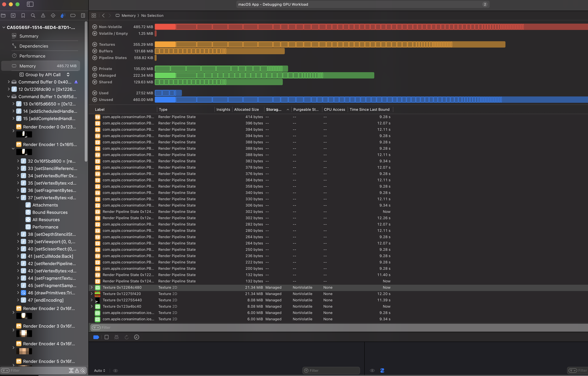

# Native WebGPU Profiler

Native GPU profilers to capture and analyze WebGL or WebGPU frames.

*Built for [BuildCores](https://buildcores.com/) and [worldmatrix](https://github.com/HarshdeepKahlon/worldmatrix?tab=readme-ov-file).*

<p align="center">
  
  
</p>

## Quick start

Clone the repo, then:

```bash
cd native-gpu-profiler
./ngp doctor
```

`./ngp` builds the Swift binary automatically when needed, then runs it.

## The two commands most people need

### WebGL

```bash
./ngp trace webgl 'https://your-app.example'
```

- Default runtime: `webkit`
- Output: `./traces/*.gputrace`
- Opens in Xcode automatically

Use this when you want the Xcode GPU frame capture / replay flow.

If the site blocks iframe embedding, use:

```bash
./ngp trace webgl 'https://your-app.example' --webgl-mode in-page
```

### WebGPU

```bash
./ngp trace webgpu 'https://your-app.example'
```

- Default runtime: `chrome`
- Output: `./traces/*.trace`
- Opens in Xcode automatically

Use this when you want the fastest path to a Metal System Trace.

## What happens on first run

- `trace webgl` with `--runtime webkit` may clone and build WebKit MiniBrowser.
- That first build is slow.
- After that, captures are much faster.

## Common options

```bash
./ngp trace webgl 'https://your-app.example' --capture-after 20
./ngp trace webgl 'https://your-app.example' --runtime chrome
./ngp trace webgpu 'https://your-app.example' --runtime webkit
./ngp trace webgl 'https://your-app.example' --output-dir ./my-traces
./ngp trace webgl 'https://your-app.example' --no-open-xcode
./ngp trace webgl 'https://your-app.example' --verbose
```

## Advanced command

If you need full control, use `profile` directly:

```bash
./ngp profile --url 'https://your-app.example' --graphics-api webgl --runtime webkit
```

## Useful commands

```bash
./ngp doctor
./ngp webkit ensure
./ngp helper webgl-snippet
./ngp --help
```

## Runtime guide

- `webkit`: best for WebGL frame replay in Xcode (`.gputrace`)
- `chrome`: best for quick Metal timeline captures (`.trace`)

## Requirements

- macOS
- Xcode command line tools
- Apple Silicon is the tested path
- Chrome, Chrome Canary, or Chromium for `chrome` runtime

## Notes

- Traces are stored in `./traces` by default.
- `traces/` is ignored by git except for `.gitkeep`.
- For WebGL, `wrapped` mode injects a small hidden WebGPU helper workload so Xcode can see GPU activity.
